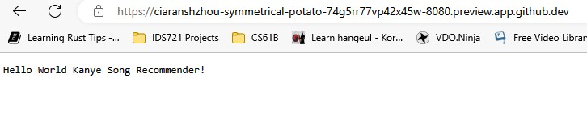

# Project2-Microservice-in-Rust-with-MiniKube

## Key Objectives of Project
A. Implement a microservice, Kanye West Song Recommender.  
B. Containerize it and push it to AWS ECR, and run it on AWS App Runner.  
C. Use MiniKube to deploy the microservice.

## 1. Set up
* Create a Dockerfile.

* Create a Makefile.

* Set up the Cargo.toml to include the dependencies.

### 2. Test the project locally.

* To compile the rust project, type:

  `cargo build`

* To run the project, type:

  `cargo run` 

  add /kanye to the address for the actual recommendation  
  

## 3. Deploy the project on the cloud via AWS App Runner

* 1. Deploy the codebase on AWS Cloud9.

* 2. Create a repository on AWS Amazon Elastic Container Registry.

* 3. Push the image by running commands according to "View push commands".

* 4. Create a new service in AWS App Runner.

## 4. Deploy the project via Minikube

* 1. Push the docker to the Dockerhub: https://hub.docker.com/r/jzhang538/project2 
* 
* 2. `minikube start`

* 3. `minikube dashboard --url` for the Kubernetes Dashboard

* 4. Create a deployment: `kubectl create deployment kanye --image=registry.hub.docker.com/jzhang538/project2`

* 5. View deployment: `kubectl get deployments`

* 6. Create service and expose it: `kubectl expose deployment kanye --type=LoadBalancer --port=8080`

* 7. View services: `kubectl get service kanye`

* 8. `minikube service kanye --url`

* 9. Curl web service `curl [url get from last step]`

* 10. Cleanup

`kubectl delete service kanye`
  
`kubectl delete deployment kanye`
  
`minikube stop`
