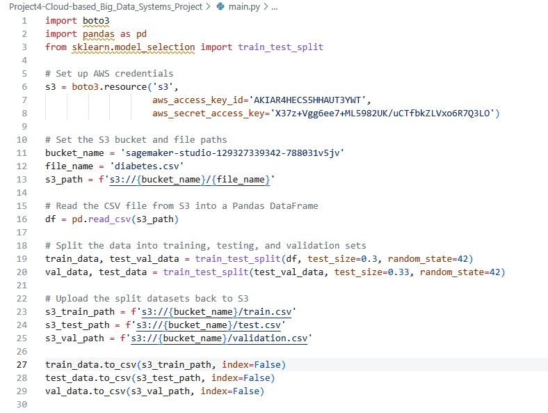
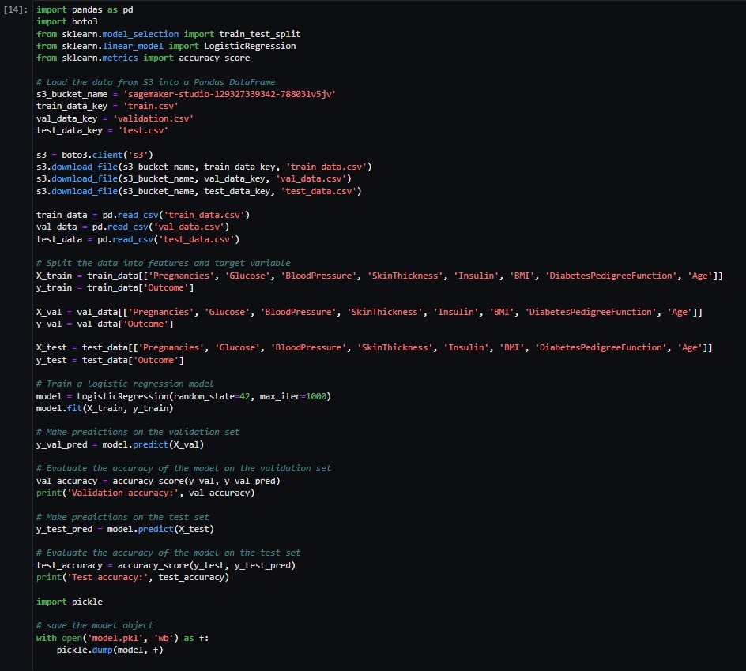

# Project4-Cloud-based Big Data Systems Project

## Overview
Use cloud-based tool, specifically AWS, to build a machine learning model to predict diabetes. I used a [diabetes dataset from Kaggle](https://www.kaggle.com/datasets/akshaydattatraykhare/diabetes-dataset)  

## 1. Data Processing
* Upload the csv file to S3 Bucket

* Split the data into 70% training set, 20% validation set, and 10% testing set. Then upload it to S3 Bucket

### 2. Build and train the model on Sagemaker Notebook

The model achieves validation accuracy of 74% and test accuracy of 73%.  

### 3. Future work
With the model.pkl file, we can deploy it to a couple of AWS services so it can be used as a serverless function that takes input and make predictions.
